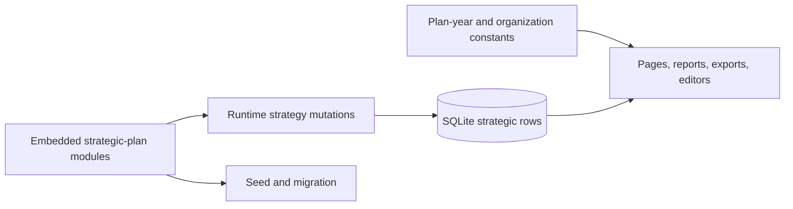
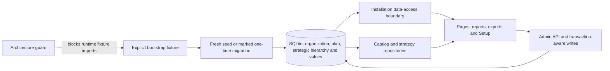

# Database-authority migration handoff

Status: implementation and validation ledger for ADR 0023

Baseline: `4ffa5f3219b32e595d9345a64126b78e70b79e40` (green `origin/master`
after PR #62)

## Data moved and retained

Schema 12 persists one active Organization and Strategic Plan, including
display names, stable slugs, plan name/description, inclusive plan years,
status, source reference, revision, creation/update ownership, and immutable
installation audit snapshots. Every Strategic Priority (`categories`) now has a
required `plan_id`. Existing database rows remain authoritative for priorities,
Strategic Goals, Goal–KPI Memberships, KPIs, measurement configurations,
components, targets, distribution bands, observations, values, ordering,
statuses, provenance, and audit history.

Code retains generic domain invariants: supported measurement types,
frequencies, formulas, aggregation roles, completion rules, statuses, period
rules, 1900–2100 storage bounds, auth/CSRF rules, export columns, and rendering
copy. Eastern State definitions remain only as explicit seed/migration/test
input. Logo/font assets remain presentation assets; schema 12 does not create
asset administration.

## Hard-coded-source removal ledger

| Former authority | Replacement | Runtime disposition |
| --- | --- | --- |
| `STRATEGIC_PLAN_START_YEAR`, `STRATEGIC_PLAN_END_YEAR`, reporting/data-entry year arrays | `getActiveInstallation()` and its derived inclusive `years` | Constants and production imports removed |
| Strategic catalog/config arrays | Existing persisted catalog/strategic tables | Imports allowed only from explicit bootstrap/seed/test paths; architecture guard blocks runtime imports |
| Canonical reconciliation invoked by every migration command | schema-12 one-time content-migration marker | Marker is removed only after a successful explicit pass; subsequent runs never reconcile content |
| Eastern State report fallback and filename prefixes | persisted organization name/slug | Malformed/uninitialized presentation fallback is generic `Organization`/`Strategic Plan` |
| App-shell installation title | persisted organization short name and plan name | Every protected page supplies database identity |
| Fixed 2025–2029 editor/API checks | active plan range loaded inside transaction-aware operations | Boundary schemas retain only generic year shape |
| Plan-specific SQLite defaults/check | schema-12 generic year checks plus domain validation | Fresh and upgraded goal/membership/target tables contain no 2025/2029 default/check |
| Runtime canonical feature facade | explicit script imports and typed database modules | `src/features/catalog/index.ts` removed; strategy server/index do not export bootstrap reconciliation |

No production page, route, report, export, or ordinary strategic operation
imports an embedded canonical business-data module. No runtime fallback creates
or reconciles strategic content from the fixture.

## Data-access boundaries

- `src/features/installation/server.ts` owns typed active-installation reads,
  deterministic year derivation, optimistic revision updates, plan-range
  integrity checks, and installation audit mapping.
- Existing catalog and strategy repositories remain the domain boundaries for
  priorities, measures, goals, memberships, configurations, components,
  targets, bands, observations, distributions, and audit history.
- Server pages/report adapters load installation metadata and pass plain typed
  props into client/presentational components. Components never open SQLite.
- Strategic configuration and value writes enforce the persisted plan range
  inside repository transactions. API schemas enforce generic shape and reuse
  the existing admin, same-origin, JSON, and CSRF boundaries.
- Explicit `scripts/seed.ts` and the one-time marked `scripts/migrate.ts` pass
  fixture data into a generic initializer. Ordinary startup and requests do
  not call it.

## Dependency graph

Before:

After:

## Migration and recovery

The 11→12 migration is one immediate transaction with foreign keys disabled
only for the required SQLite table rebuilds. It creates ownership/audit rows,
attaches priorities without changing their IDs, rebuilds plan-specific
goal/membership/target table definitions with generic constraints, runs
`PRAGMA foreign_key_check`, records schema 12 plus the one-time content marker,
and commits. Any failure rolls back to the previous schema state.

Schemas 9 and 10 traverse their existing additive transitions before schema
12. The explicit migration command consumes the marker once: a legacy catalog
with empty strategic sidecars receives the initial configuration; a matching
historical strategic database may receive only the existing fingerprinted
repairs. The marker is then deleted. An existing schema-12 installation is not
reinitialized even if strategic rows are absent.

Recovery is stop writes, restore the consistent pre-migration database/WAL/SHM
backup, and deploy the matching prior application. There is no destructive
in-place downgrade.

## Administrative behavior

Setup retains its existing Measures, Goals, People, and Activity workspaces.
The smallest missing capability is added above Setup → Goals: an admin can edit
the Organization display/short names and Strategic Plan name, description,
start/end years, and source reference. Saves use the existing protected
`PATCH /api/categories` boundary, shared request/domain validation, an expected
revision, a single transaction, and immutable audit events. The form joins the
shared stay/discard guard, focuses the first invalid field, exposes field-level
year errors, and retains its draft after failed saves. Range contraction is
rejected when it would exclude active definitions or persisted observations;
archived definitions, targets, and bands may remain as historical records.
Existing
editors continue to manage priorities, measures, goals, memberships,
definitions, components, targets, bands, and values.

## Validation receipts

| Gate | Receipt |
| --- | --- |
| Unit/integration/contracts | `82 files / 1,217 tests` passed in the isolated worktree and again from a clean clone |
| Focused schema migration | `10/10` passed, including schema 9/10/11 paths, stable IDs, generic constraints, FK checks, injected-failure rollback, and idempotent reopen |
| Public migration entrypoint | `9/9` passed, including one-time initialization/repair and initialized-database no-rebootstrap |
| Installation persistence | `6/6` passed, including missing/ambiguous state, bootstrap-once, optimistic editing/audit, and archive-aware range contraction |
| TypeScript and production build | `npm run design-system:test` passed from the isolated worktree and clean clone, including `next typegen`, `tsc --noEmit`, and the explicit Webpack production build |
| Repository guards and lint | design tokens/system, auth bypass, architecture, hygiene, ShellCheck/injection, and zero-warning ESLint all passed |
| Browser acceptance | authenticated production Chrome suite passed `11/11`; the intentional final recovery test temporarily removes `strategic_goals` and restores it after verifying route recovery/focus |
| Production container | final image `eastern-state-kpi:db-authority-final` (`sha256:3a75c77bd742…`) built from the clean clone; authenticated smoke passed `53/53` against the container-owned SQLite database |
| Security scanners | OSV scanned 594 packages with no issues; Gitleaks scanned the four-commit branch range with no leaks; Semgrep ran 13 rules across 278 files with 0 findings; pinned Trivy 0.70.0 found 0 fixable HIGH/CRITICAL OS or library vulnerabilities |
| Clean-clone data rehearsal | isolated `npm ci` succeeded; fresh seed produced schema 12, one active organization/plan, 5 priorities, 59 KPIs, 22 goals, 59 configurations/memberships, 46 components, and zero FK violations; two migration reruns were no-ops; focused migration/installation suite passed `25/25` |
| Two-axis self-review | specification and standards reviewers found migration rollback, literal-year defaults, archived range handling, shared validation, wrapping, field errors, loading semantics, dirty navigation, and stale `AGENTS.md` gaps; every finding was corrected and revalidated |
| Diff hygiene | `git diff --check` passed |
| Architecture boundary | `npm run architecture:guard` passed with bootstrap/reconciliation/year-authority checks |
| Hosted PR checks | Draft PR #63 is open, mergeable, and unmerged. Required CI, typecheck, lint, unit/integration, authenticated E2E, Dependency Review/OSV, Gitleaks, Semgrep, CodeQL for JavaScript/TypeScript and Python, container Trivy, and Vercel preview all passed. Scorecard intentionally runs only on `master`/schedule/manual dispatch; the baseline `4ffa5f3` master run passed before this branch was cut. |

## Known risks and deferred decisions

- The product remains intentionally single-installation. The ownership schema
  is future-safe, but there is no tenant selector or tenant-scoped auth.
- Organization and plan stable slugs are not editable in Setup because changing
  external identifiers/filenames needs a separate rename contract. Display
  names, plan copy, years, and source reference are editable.
- Logo/font administration is out of scope; existing Eastern State assets are
  presentation assets, not a second source for textual installation identity.
- Legacy rows and `entry_history` remain the documented read-only archive.
- Plan contraction is deliberately conservative for active records. Operators
  must archive or successor-date conflicting definitions/targets/bands and
  remove conflicting observations through supported audited workflows before
  shortening a plan. Archived definitions remain available as history without
  blocking the new active range.
- The generic bootstrap initializer remains internal to the strategy mutation
  module but is absent from the runtime public facade, takes all content as an
  explicit argument, and is guarded against runtime callers. Moving that
  implementation into a separate package would add churn without changing the
  authority boundary.
