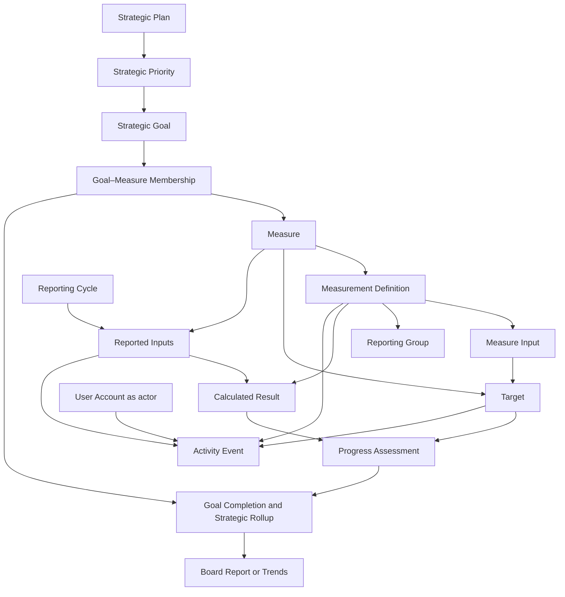

# Eastern State Strategic Plan product foundation

Status: current product authority  
Evidence cutoff: July 15, 2026

This document preserves the product decisions that sit between Eastern State's
strategic-plan source material and the implemented interface. ADR 0022 remains
the authority for the four-destination boundary and legacy archive. `CONTEXT.md`
remains the detailed domain glossary. `DESIGN.md` remains the visual-system
authority. This document owns the cross-layer product model: evidence, needs,
strategy, objects, vocabulary, navigation, flows, states, and the constraints a
future Taste redesign must preserve.

Where older route or interaction notes conflict with this document and ADR
0022, they are historical evidence rather than current product requirements.

## Evidence and confidence

Use these labels in product decisions:

- **Repository fact** — directly supported by current source, schema, tests, or
  an accepted ADR.
- **Stakeholder requirement** — stated in the source strategic-plan artifact or
  accepted product documentation, but not observed in use.
- **Observed application behavior** — reproduced in a running build during a
  browser walkthrough.
- **Inference** — a reasonable interpretation of the evidence.
- **Assumption** — plausible but not yet validated with the people doing the
  work.
- **Unknown** — the repository does not answer it safely.

### Available evidence

| Evidence | What it supports | What it does not support |
| --- | --- | --- |
| Local, untracked `Eastern.State.Strategic.Dashboard.2025.2029.8.1.25.pdf` | Five priorities, named goals, KPI/data/result/target fields, Board-level notes, and unresolved TK/TBD decisions; this document records the durable product conclusions needed by a clean clone | User behavior, task frequency, usability, or preferred terminology |
| Accepted ADRs, especially 0020–0022 | Canonical strategic data, calculation ownership, four destinations, permissions, archive, and migration boundaries | Whether the workflow matches real reporting handoffs |
| Current source, schema, unit/contract tests, smoke, and Playwright acceptance | Implemented rules, supported actions, permissions, and tested recovery behavior | Why people behave as they do or whether a feature is valuable |
| July 15 browser walk at desktop and 390 px | Rendered hierarchy, navigation, current copy, responsive behavior, and available feedback | Viewer behavior, production data quality, or longitudinal usage |
| README and earlier product briefs | Documented intent to support executive leadership and Board reporting | Direct research evidence |

No interviews, contextual observation, support-ticket corpus, usability-study
notes, or product analytics were found. No claim in this foundation is marked
as observed user behavior.

## Layers orientation

This was the decision landscape before this foundation was consolidated:

| Layer | State | Diagnosis |
| --- | --- | --- |
| Observed behavior | Weak | No direct user research or behavioral analytics. This is the primary bottleneck. |
| Domain | Strong | The source artifact, `CONTEXT.md`, ADRs, and calculation docs define the space in detail. Historical and implementation terms still create seams. |
| User needs | Assumed | Leadership review and reporting-administration needs are well supported by product intent, but not validated through observed work. |
| Product and service strategy | Partial | The decision-support direction and four-destination bet are clear; a bounded outcome metric and discovery loop were not. |
| Conceptual model | Partial | Objects and rules exist, but were scattered across tables, types, routes, and docs. |
| Interaction structure | Strong | Four destinations, drill-downs, Admin gating, server-confirmed saves, and core recovery paths are implemented and acceptance-tested. Some cross-links and global error states remain unresolved. |
| Surface | Partial | A shared visual system and component library exist, but `DESIGN.md` retained obsolete route and card-grid examples and the live 390 px Overview has a collision defect. |

The bottleneck is **observed behavior**. It makes the user-needs and outcome
decisions below explicit hypotheses, even when the implemented solution is
mature.

### Required validation

The next discovery work should answer three questions:

1. During the last real reporting cycle, who requested, sourced, checked,
   entered, reconciled, and presented each result, and where did work leave the
   application?
2. During the last leadership or Board review, what decisions were made from
   the report, which evidence or caveats were required, and what caused people
   to distrust or recheck a number?
3. When an Admin encounters a missing definition, missing target, rejected
   save, or conflicting change, what do they do next and what evidence must be
   preserved?

Use contextual inquiry during one real reporting cycle, followed by task-based
walkthroughs with reporting Admins and decision reviewers. Instrument only the
minimum privacy-safe events needed to measure cycle completion, retry, and
export behavior. Six to ten interviews may be a useful recruiting range, but
sample size must follow role coverage and saturation rather than a ceremonial
quota.

## People, situations, and needs

`Admin` and `Viewer` are permission roles, not personas.

- A **decision reviewer** is someone preparing for or participating in a
  strategic-performance review. They may hold either role.
- A **reporting Admin** is someone responsible for recording results,
  completing definitions and targets, managing access, or reviewing history.
  They must hold the Admin role.
- A **system operator** provisions credentials, migrates the database, and
  releases the application. That operational role is outside the four product
  destinations except where it manages People.

The needs are prioritized by decision integrity and workflow dependency, not
claimed usage frequency.

| Priority | Situation and need | Desired outcome | Evidence | Confidence |
| --- | --- | --- | --- | --- |
| 1 | When a strategic review is approaching, a reviewer needs to see overall progress and the few areas requiring attention. | Focus the meeting and decisions without scanning 59 Measures. | Product intent, Overview implementation | Inferred |
| 1 | When a result affects a decision, a reviewer needs its Target, source context, calculation state, and unresolved caveats. | Trust the conclusion or know exactly why it is not decision-ready. | Source artifact, calculation/report contracts | Inferred |
| 1 | When reporting for a period, an Admin needs to know what remains and enter the exact raw inputs required by each Measure. | Complete the cycle without a parallel reconciliation worksheet. | Data Entry workflow and acceptance tests | Inferred |
| 1 | When setup is incomplete, an Admin needs the missing decision, owner, due date, and affected reporting consequence. | Resolve the definition without turning unknowns into zero or failure. | Source TK/TBD fields, Setup model | Inferred |
| 2 | When a save fails or a person tries to leave with changes, an Admin needs to keep the draft and understand how to recover. | Avoid silent loss, partial multi-input saves, and duplicate work. | Browser behavior and e2e tests | Repository-supported requirement |
| 2 | When presenting or sharing results, a reviewer needs the exported Board Report to match the visible reporting truth. | Avoid discrepancies between screen, CSV, PNG, print, and PDF. | Export contract and acceptance tests | Repository-supported requirement |
| 2 | When definitions, Targets, values, or access change, an Admin needs history to retain the prior meaning and actor. | Explain decisions later without rewriting history. | Audit and effective-dating contracts | Repository-supported requirement |
| 3 | When work is incomplete or sensitive, people need calm, specific language that does not overstate certainty. | Feel safe presenting the product without caveats being hidden. | Existing copy and domain rules | Inferred |

## Product strategy

### Outcome

The product should increase the share of scheduled reporting cycles that are
**review-ready by the agreed review date**.

Review-ready is a provisional operational definition, not a stored object or a
claim about current stakeholder language. A cycle is review-ready when:

- required Measures have a usable Measurement Definition and Target or an
  explicit unresolved reason;
- expected Reported Inputs for the selected period are recorded or explicitly
  identified as missing;
- no invalid calculation is represented as a valid result;
- excluded Goals and Measures remain visible with reasons; and
- the visible Board Report and exports agree.

Proposed primary metric: `review-ready cycles by due date / scheduled cycles`.
Guardrails: unresolved items never enter a completion denominator, missing is
never zero, no partial multi-input save is reported as complete, and no report
export disagrees with the visible report model. The reporting cadence, due-date
owner, and acceptance authority are assumptions to validate before this metric
is instrumented.

### Current solution bets

| Journey moment | Opportunity | Current bet | Riskiest assumption |
| --- | --- | --- | --- |
| Prepare a review | I cannot tell what requires discussion quickly. | A narrow Overview with one organization rollup, five Strategic Priorities, and a bounded attention list. | The shown rollup and attention reasons match the review agenda. |
| Investigate a result | I need to understand what a summary means. | Priority and Measure drill-downs preserve Reporting Year and show results, Targets, inputs, history, and caveats. | This is enough evidence without an additional reconciliation artifact. |
| Complete reporting | I do not know what is due or safe to submit. | A period-scoped checklist with one focused Measure form and one atomic save. | One Admin can complete or coordinate the cycle through this workflow. |
| Resolve ambiguity | I need to finish a definition without corrupting history. | Setup consolidates Measures, Goals, People, and Activity and uses effective-dated successors. | Splitting Measure setup and Target editing across two areas remains understandable. |
| Present results | I need a Board-ready artifact that matches the product. | Reports loads one selected Board Report or Trends view and exports only that visible report. | The report structure matches how leadership and the Board consume evidence. |

Do not add destinations or broad visual concepts until observation shows one
of these bets is wrong. The cheapest next tests are a real-cycle observation,
a decision-review walkthrough, and an Admin recovery task—not another redesign.

### Constraints and risks

- The product is internal, authenticated, and online-required.
- Viewer is read-only; Admin owns every product mutation.
- SQLite is the persistent runtime and requires additive migrations and backup
  discipline.
- Strategic observations are the sole current reporting truth. Legacy rows are
  a read-only archive, never fallback inputs.
- Effective dating, immutable history, audit attribution, and session/security
  boundaries are product constraints, not implementation trivia.
- The source artifact contains unresolved TK/TBD decisions; the product must
  preserve uncertainty honestly.
- The Admin role combines data entry, configuration, access, and audit powers.
  Whether those duties need separation is unknown.
- There is no verified offline workflow or concurrent-edit conflict contract.
- Linear annual pacing is valid only for evenly paced Measures; it must not be
  applied by default to milestones or seasonal work.

## Domain seams and canonical vocabulary

The domain has four bounded contexts:

1. **Strategic planning** — Strategic Plan, Strategic Priority, Strategic Goal,
   Measure, Target, and Board Status.
2. **Measurement and reporting** — Measurement Definition, Reporting Frequency,
   Reporting Period, Reported Inputs, Calculated Result, progress, and rollups.
3. **Administration and accountability** — User Account, role, ownership,
   effective changes, archive/restore, and Activity Event.
4. **Legacy archive** — Legacy Category, Legacy Entry, Legacy KPI Goal, and
   Entry History. These terms exist only where the historical distinction is
   material.

Source, product, and implementation language legitimately diverge. The product
must choose one label while documentation may record the seam:

| Canonical product term | Definition | Do not use as an alternate product label |
| --- | --- | --- |
| Strategic Plan | The time-bounded 2025–2029 plan being measured. | Dashboard, scorecard |
| Strategic Priority | A top-level plan area that groups Strategic Goals. | Category, pillar |
| Strategic Goal | A named outcome evaluated from its Goal–Measure Memberships. | Goal when meaning Target; KPI Goal |
| Measure | A stable performance indicator. `KPI` remains a source/schema/code alias. | Metric, field, KPI in surface copy |
| Goal–Measure Membership | The effective-dated relationship assigning a Measure to a Strategic Goal, with role, order, and optional weight. | Link, mapping |
| Measurement Definition | The effective-dated rule for what is reported and how a Calculated Result is produced. | Config, formula setup |
| Measure Input | An independently defined part of a multi-input Measure. | Child KPI, submetric, form field |
| Reporting Group | A configured classification within a distribution. | Breakdown label, demographic band when the grouping is not demographic |
| Reporting Frequency | How often a Measure accepts reporting. | Reporting Period |
| Reporting Period | The concrete month, quarter, full year, cumulative point, or one-time point being reported. | Reporting Frequency, month zero |
| Reported Inputs | The persisted raw evidence for one Measure and Reporting Period, including Measure Inputs or Reporting Groups when required. | Calculated Result, score, generic entry |
| Calculated Result | The reproducible outcome derived from Reported Inputs under a Measurement Definition. | Reported Inputs, stored value |
| Target | The desired annual or full-plan outcome for a Measure or Measure Input. | Strategic Goal |
| Needs attention | A derived work condition grouping missing definitions, Targets, owners, or answers. It is not a domain object or a substitute status. | Failed, zero, Configuration Gap in surface copy |
| Board Status | An explicit management assessment. | Setup Status, Progress State, Calculation State |
| Setup Status | Readiness of a definition or Target. | Board Status, Progress State |
| Calculation State | Valid, missing, or invalid result classification. | Progress State, Board Status |
| Progress State | Target-progress classification such as not started, in progress, complete, or exceeded. | Board Status, Setup Status |
| Activity Event | An immutable record of a data or setup change. | Mutable log item |

Always qualify `status`. Use `Annual Target` and `Full-plan Target`; use
`Annual Pacing`, `Annual Completion`, and `Full-plan Progress` only for their
distinct calculations. Use `Legacy` as a prefix whenever an archive concept
would otherwise collide with the current model.

## Conceptual model

The model is deliberately smaller than the database and API surface.
`kpi_component_entries`, `distribution_observations`, and their routes are
storage shapes beneath one user-visible Reported Inputs concept.

| Object | Kind | What people care about | Primary actions |
| --- | --- | --- | --- |
| Strategic Plan | Persistent | Name, start/end years, scope | Review |
| Strategic Priority | Persistent | Name, order, Goal completion | Review, open Goals |
| Strategic Goal | Persistent, effective-dated | Name, completion rule, memberships, Board Status, unresolved work | Configure, revise for future years, archive/restore, review |
| Measure | Persistent identity | Name, Strategic Priority, direction, lifecycle, related Goals | Create, review, archive/restore |
| Goal–Measure Membership | Relationship object, effective-dated | Required/informational role, weight, order | Assign, revise for future years, archive/restore |
| Measurement Definition | Persistent, effective-dated | Measurement Type, Frequency, formula labels, unit, aggregation, Setup Status, owner/source | Define, revise for future years, archive/restore |
| Measure Input | Persistent, effective-dated | Label, Measurement Type, unit, role/weight/order | Define, reorder, revise, archive/restore |
| Reporting Group | Persistent, effective-dated | Label, order, exclusivity/classification | Define, reorder, end and replace, archive/restore |
| Target | Persistent, effective-dated | Annual/full-plan scope, value/description, year, baseline, Setup Status | Define, revise for future years, archive/restore |
| Reporting Cycle | Derived | Reporting Year, Reporting Period, checklist items and completion | Select, review checklist, continue reporting |
| Reported Inputs | Persistent | Measure, period, raw values, source, notes, actor/time | Record, correct, remove |
| Calculated Result | Derived | Value, Calculation State, issues, provenance | Review only |
| Progress Assessment | Derived | Result, Target, baseline, actual/display percent, Progress State | Review only |
| Goal Completion and Strategic Rollup | Derived | Eligible denominator, excluded reasons, completed count/percentage | Review only |
| Report | Derived presentation | Board or Trends type, Reporting Cycle, same reporting truth, export formats | Select, review, export |
| User Account | Persistent | Name, role, active/disabled state, credential state | Create, change role/status, reset, delete |
| Activity Event | Persistent and immutable | Actor, time, action, before/after snapshot, historical labels | Review/filter only |

### State and time contracts

| Concern | States or decision |
| --- | --- |
| Setup Status | `Draft`, `Needs definition`, `Needs target`, `Ready`, `Active`, `Archived`. `Needs attention` groups several of these; it is not another status. |
| Checklist item | `Not started`, `Needs attention`, `Complete`. Completion is server-derived and survives reload. |
| Save interaction | `Unsaved` → `Saving` → `Saved`; validation or transport failure returns to an editable draft and exposes retry. `Saved` is feedback, not a durable object state. |
| Calculation State | `Valid`, `Missing`, `Invalid`. Missing and invalid are never zero. |
| Progress State | `Not started`, `In progress`, `Complete`, `Exceeded`, `Target not finalized`, `Needs definition`. |
| Board Status | `Not reported`, `Not started`, `On track`, `At risk`, `Off track`, `Complete`, `Exceeded`, `Not applicable`. |
| User Account | Active or Disabled; Admin or Viewer; may require password change. Role and status changes revoke prior sessions. |
| Effective relationships | The selected Reporting Year chooses the applicable Definition, Membership, Target, Input, and Reporting Group. |
| Semantic change | Once reporting or Targets depend on semantics, create a future successor instead of editing history in place. |
| Removal | Archive is the reversible strategic lifecycle. Delete is reserved for removable records and non-strategic catalog metadata after audit/dependency rules pass. |
| Read after write | Show success only after the server commits. The next view and reload must reflect the committed value. |

## Information architecture

The authenticated product has exactly four top-level destinations. Viewer sees
the first two; Admin sees all four.

| Place | Audience | Purpose | Required content and affordances |
| --- | --- | --- | --- |
| Overview | Viewer, Admin | Orient to organization performance and attention | Reporting Year, organization rollup, five Strategic Priorities, bounded attention list, Priority drill-down |
| Reports | Viewer, Admin | Review and share the selected report | Report type, Reporting Year/Period, visible Board Report or Trends, matching exports |
| Data Entry | Admin | Complete one Reporting Cycle | Reporting Year/Period, checklist, focused Measure, exact raw fields, source/notes, save/retry/continue |
| Setup | Admin | Govern definitions, Targets, access, and accountability | Persistent areas: Measures, Goals, People, Activity |

Priority (`/dashboard/category/[slug]`) and Measure
(`/dashboard/metric/[slug]`) are supporting drill-down places, not additional
destinations. `/login` and `/setup-password` are authentication places. The
former `/admin/*`, `/dashboard/trends`, and legacy mutation routes remain
removed, not redirects or hidden alternatives.

Navigation rules:

- preserve Reporting Year through Overview → Priority → Measure drill-down;
- keep report type/year/period and Data Entry year/period in the URL so views
  are reloadable and linkable;
- show only actions the current role can perform;
- warn before any navigation that would discard a dirty form;
- mobile navigation contains the same role-appropriate destinations in the
  same order; and
- a Target belongs to its Measure even though the current editing affordance
  is grouped under Setup → Goals. Measures that need a Target must expose a
  direct contextual route to the applicable Goal/Target editor in the future
  surface; do not require people to rediscover it through navigation.

## Required flows

### Primary: review strategic performance

**Overview**
- select Reporting Year → refreshed Overview
- open Strategic Priority → Priority detail with the same year
- open Reports → Reports default or last link state
- content: organization completion, denominator, five Priorities, attention

**Strategic Priority**
- return to Overview → Overview
- select Reporting Year → same Priority, new effective model
- open Measure → Measure detail with the same year
- content: Goal completion, excluded reasons, member Measures and status

**Measure**
- return to Strategic Priority → Priority detail
- select Reporting Year → same Measure, new effective model
- content: Calculated Result, qualified Board/Calculation/Progress states,
  Annual and Full-plan Targets, inputs, reported history, attention reasons

**Reports**
- select Board Report or Trends → only that report is loaded and visible
- select Reporting Year/Period → same report type with new cycle
- export visible report → download, print dialog, or an actionable error

Success means the reviewer can name the performance state, denominator,
unresolved caveat, and evidence path without inferring missing data. Empty or
partial data stays visible as `Not available`, `Not reported`, `Target not
finalized`, or an exact exclusion reason. A Viewer is never instructed to use
Admin-only Data Entry or Setup.

### Primary: complete a reporting cycle

**Data Entry checklist**
- select Reporting Year/Period → checklist for that cycle
- open any Measure → focused Measure form
- content: complete/attention counts and per-Measure state

**Focused Measure**
- enter every required raw field, source, and notes → editable draft
- submit invalid draft → inline errors; keep every entered value
- save → `Saving`; disable duplicate submission
- commit succeeds → `Saved`, checklist updates, next unfinished Measure opens
- commit fails or connection drops → `Couldn't save`, draft remains, `Try again`
- navigate while dirty → stay and keep editing, or explicitly leave and discard
- reload after success → committed values and completion remain

Multi-input Measures save all Inputs and Reporting Groups atomically. The
interface never exposes internal month zero. A Measure blocked by missing
semantics remains visible with its reason; it is never silently skipped.

### Secondary flows

- **Resolve attention:** Setup → Measures → Needs attention → Measure → define
  reporting semantics/Inputs/Groups → contextual Goal/Target editor → Ready.
- **Configure a Goal:** Setup → Goals → choose Goal → completion rule,
  memberships, annual/full-plan Targets → save or create a future successor.
- **Manage access:** Setup → People → create account, reset credential, change
  role, disable/enable, or delete; self-lockout actions remain unavailable.
- **Review accountability:** Setup → Activity → Data changes or Setup changes →
  filter/paginate; immutable labels and actor/time survive rename or delete.
- **Authenticate:** Login → valid session; temporary credential → required
  password change → session invalidated → sign in again. Unknown, disabled,
  deleted, and wrong-password accounts receive the same login message.

## State and recovery requirements

| State | Required treatment |
| --- | --- |
| Loading | Every route shows a structure-mirroring skeleton with stable layout and an accessible loading label. |
| Empty | Explain what is absent and why. Offer an action only when the current role can perform it. |
| Partial | Show available results and explicit missing/excluded reasons; never collapse the whole place into an error. |
| Validation | Associate specific messages with fields, preserve the draft, focus or summarize the first error, and do not mutate. |
| Saving/mutating | Disable duplicate action, announce progress, and wait for server confirmation. |
| Success | Announce what changed, refresh the affected read model, preserve context, and keep Activity attribution. |
| Server/network failure | Diagnose in plain language, state whether the draft is safe, provide retry, and avoid claiming success. |
| Export failure | Name the failed format and provide a usable fallback such as Print → Save as PDF. |
| Permission | Hide unavailable navigation, redirect protected pages safely, return 401/403 from APIs, and never present an impossible CTA. |
| Offline | The product is online-required. A disconnected save retains the in-memory draft and explains retry; no offline persistence or later synchronization is promised. |
| Concurrent edit | No conflict-resolution contract is verified. Do not claim protection. Until a versioned policy is designed, treat last-write behavior as a risk and rely on Activity only for evidence, not prevention. |
| Unknown/not found | A missing Priority/Measure returns to Overview today. A future surface should explain the missing object without exposing implementation detail. |
| Route failure | Add route-level error boundaries with retry for the four destinations; skeletons alone do not cover rejected server loads. |

## Surface requirements

The visual system should make the product feel calm, exact, and suitable for a
high-accountability review. Confidence comes from explicit denominators,
source/caveat copy, predictable feedback, and readable hierarchy—not from
decorative authority.

- Use the canonical vocabulary above. Always qualify status labels.
- Treat a Measure consistently in checklist, Setup, drill-down, Trends, Board
  Report, and Activity: name, Priority/Goal context, result, Target, status,
  source, and available actions should remain recognizable.
- Give the most prominence to: organization completion and attention on
  Overview; report identity and reporting context in Reports; checklist state
  and the focused Measure in Data Entry; selected object and unresolved work in
  Setup.
- Keep exhaustive evidence in Reports. Keep Overview bounded; never rebuild or
  hide the Board Report there.
- Preserve one dominant action per workflow region. Secondary exports and
  destructive actions must not compete with the primary task.
- Every action needs visible hover/focus, busy, success, error, disabled, and
  permission treatment. Errors must diagnose, explain, and recover.
- Status meaning must never depend on color. Keep visible text, counts, and
  accessible names; preserve tabular numerals and progress text.
- Maintain 44 px interactive targets, logical focus order, skip navigation,
  keyboard-operable dialogs/drawers, named tables/charts, and reduced-motion
  support.
- At 390 px, reorder or stack content before it collides. Long Priority, Goal,
  and Measure names are normal data, not edge cases.
- Repeated warning states use the semantic warning treatment. Reserve the
  bright yellow signature for one focal accent; the current Overview repeats
  bright-yellow badges and therefore does not yet satisfy `DESIGN.md`'s
  single-accent intent.

The July 15 live walk confirmed consistent four-item navigation, working
desktop hierarchy, mobile list/detail transitions, explicit form labels, and
zero browser-console errors. It also reproduced a 390 px Overview collision
where long Priority names overlap `Not available` and `Needs attention`.
That is a required surface fix for the Taste implementation, not a reason to
change the conceptual model or navigation.

## Decisions and unresolved assumptions

Decisions made:

- The product is strategic-performance decision support, not a generic KPI or
  CRUD dashboard.
- `Measure` is the product term; KPI/metric/category/entry remain source,
  implementation, or legacy terms only where qualified.
- One period-scoped Reported Inputs object is visible to people even when
  persistence uses several routes/tables.
- Targets belong to Measures or Measure Inputs, not to Strategic Goals, even
  though the current Setup flow groups Target editing in Goals.
- Needs attention is a derived work condition, not a failure, score, or object.
- Calculated Results and rollups are derived and never directly edited.
- The four destinations and supporting drill-downs are sufficient until user
  observation shows otherwise.

Assumptions and unknowns requiring validation:

- the real reporting cadence, due date, review-ready owner, and approval event;
- whether one person or several departments enter and verify data;
- which Overview signals actually change leadership or Board decisions;
- whether reviewers need source documents, commentary, sign-off, or freshness
  beyond the current source/notes fields;
- whether Viewer and Admin are sufficient permission roles;
- whether Targets are best edited in Goal context or need a Measure-context
  editing affordance as well;
- acceptable concurrent-edit behavior and whether version conflicts are
  required;
- whether an offline capture/import path is needed; and
- which Board Report sections are required in meetings versus retained only as
  complete evidence.

## Taste redesign preservation contract

A future Taste redesign may change composition, density, and visual treatment,
but it must preserve:

1. exactly four role-appropriate destinations and the supporting
   Priority/Measure drill-down hierarchy;
2. the canonical vocabulary and qualified status names;
3. strategic observations as the sole current reporting truth;
4. server-confirmed, atomic saves; retained drafts; retry; and unsaved-change
   protection;
5. honest missing, invalid, excluded, unresolved, zero, and over-target states;
6. distinct Annual Pacing, Annual Completion, and Full-plan Progress;
7. visible denominators, Targets, sources, provenance, and caveats wherever a
   result supports a decision;
8. Viewer/Admin permissions, forced password change, and immutable Activity;
9. Reports as the only Board Report/Trends and export place—no hidden report in
   Overview;
10. effective-dated successors, archive/restore, and historical meaning;
11. `Sample data` disclosure and no user-facing month zero;
12. the shared `src/components/ui/` library, design tokens, and CI guardrails;
13. keyboard, screen-reader, touch-target, contrast, non-color meaning, and
    reduced-motion accessibility; and
14. responsive layouts that tolerate the longest real names without overlap,
    truncation of meaning, or unreachable actions.

Do not begin the Taste pass by changing colors or cards. Start with the 390 px
collision, Measure/Target cross-link, report scanability, role-appropriate
empty states, and route-level error/recovery gaps identified here; then apply
the visual system to the resolved structure.
